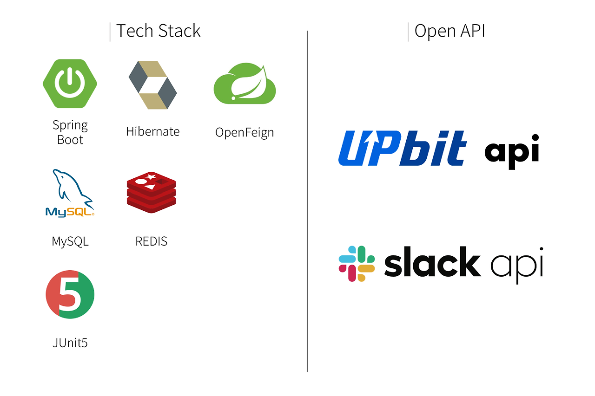

# Slack 워크스페이스용 가상화폐 시세 정보 API

---

## 개요

슬랙 워크스페이스에서 사용할 수 있는 가상화폐 시세 정보 API입니다.

이 API를 통해 최신 가상화폐 시세 정보를 슬랙 워크스페이스에서 확인할 수 있습니다.

--- 

## 기능
- **슬래시 커맨드를 통한 시세 정보 요청**: 사용자는 슬랙 내에서 간편하게 슬래시 커맨드를 이용하여 가상화폐의 현재 시세를 조회할 수 있습니다.
- **실시간 시세 알림**: 선택한 가상화폐의 시세가 특정 조건을 만족할 때 자동으로 알림을 받을 수 있습니다.

---

## 🔧 기술 스택

### ✒️ 기술적 의사 결정

OpenFeign

- **OpenFeign** vs RestTemplate

  - Spring Data JPA와 유사하게, **간결하고 선언적인 방식**으로 HTTP 요청을 구성할 수 있는 인터페이스를 제공하므로, HTTP 클라이언트 구현에 신경 쓰지 않아도 되고, 외부 서비스를 로컬 메서드처럼 쉽게 호출할 수 있습니다.
  - 여러 외부 서비스를 내 애플리케이션의 비즈니스 로직과 효과적으로 통합할 수 있고, 기능 확장에도 유연하게 대응할 수 있을 것이라 판단해 **OpenFeign**을 선택했습니다.

JPA

- **JPA(Hibernate)** vs MyBatis

  - DB 매핑을 자동화해 주고, 기본적인 CRUD를 제공하므로, 비즈니스 로직에 더 집중할 수 있습니다.
  - 이 프로젝트의 목표는 **비즈니스 로직과 외부 서비스 통합**이므로, 복잡한 쿼리와 고급 매핑에 유리한 MyBatis보다, 직관적이고 객체 지향적으로 데이터 처리 작업을 수행할 수 있는 **JPA**가 적합하다고 판단했습니다.

Redis

- **Redis**

  - 사용자의 요청에 따라 일정 간격(실시간 또는 분 단위)마다 시세 정보와 목표 가격를 저장·조회해야 하므로, 낮은 지연 시간을 가진 **Redis**를 이러한 기능에 활용하는 것이 적절하다고 판단했습니다.

Slack API

- **Slack API** vs Email, SMS…

  - Slack 알림은 사용자가 즉각적으로 반응할 수 있는 환경을 제공하고, **슬래시 커맨드** 등 기능을 추가할 수 있어, 다른 서비스(웹 또는 앱)를 통하지 않고도 사용자와 애플리케이션이 상호작용을 할 수 있습니다.
  - OpenFeign을 활용한 **Slack API 통합**이 이 프로젝트 목표에 더 부합하다고 판단했습니다.

